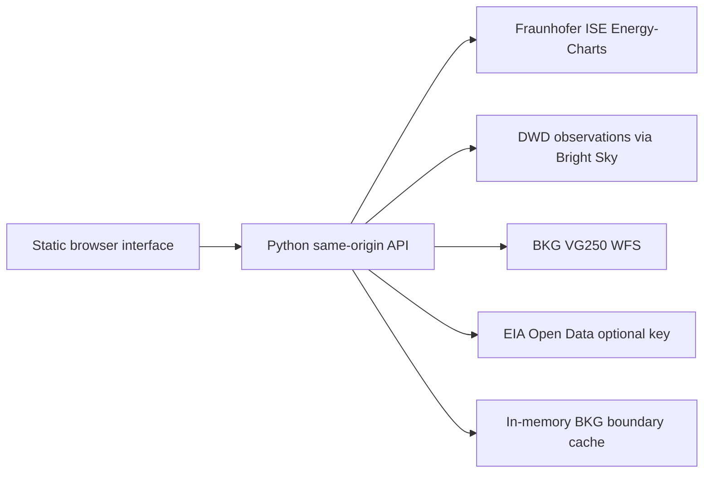

# Architecture

## Components

- `app/server.py` is a dependency-free HTTP server and data boundary. It owns credentials, fetches upstream JSON, validates payloads, caches only BKG reference geometry, and returns explicit unavailable states.
- `static/` contains a responsive source-first interface. It only calls the local server; it never calls energy APIs or exposes a token.
- `tests/` verifies the district cardinality contract and the no-synthetic-value rule.

## Source contracts

| Metric | Source | Coverage | Cadence | Credentials |
| --- | --- | --- | --- | --- |
| Day-ahead electricity price | SMARD through Fraunhofer ISE Energy-Charts | DE-LU bidding zone | published day-ahead / 15-min points | none |
| Generation and load | Fraunhofer ISE Energy-Charts | Germany | 15 minutes | none |
| Weather context | DWD observations via Bright Sky | nearest Stuttgart station | hourly | none |
| Boundaries | BKG VG250 WFS | Baden-Wuerttemberg districts | annual administrative update | none |
| Brent and Henry Hub | EIA Open Data | international / US benchmarks | source-specific | free API key |
| Coal, EUA, uranium | licensed source required | benchmark-specific | provider-specific | provider key |

## Reliability

- Operational energy and weather requests are fetched directly from their verified publishers for every overview or CSV request. No source response is written to disk or reused from the server memory cache.
- Official BKG boundary geometry is cached in memory for one day because it is administrative reference geography, not operational data.
- `/api/export` returns timestamp-aligned price, system, and available weather source rows as CSV.
- `/api/overview` and `/api/export` accept either a rolling `days` value or an explicit `start` and `end` date. The server rejects spans over 365 days to keep the 15-minute source view responsive.
- Upstream errors never trigger a fabricated fallback.
- BKG currently returns 46 Baden-Wuerttemberg geometries containing two repeated district records. The backend deduplicates by authoritative `ars` code and fails closed unless there are exactly 44 distinct features.
